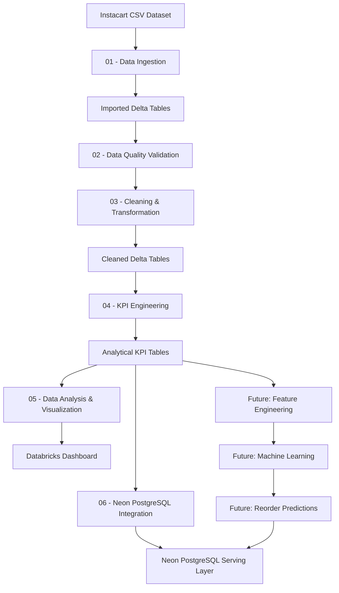

# Instacart End-to-End Data Analytics Pipeline

An end-to-end data analytics project built with **Databricks, PySpark, Delta Lake, PostgreSQL, and Neon**, using the Instacart Market Basket dataset.

The project covers the full analytics lifecycle: data ingestion, data quality validation, cleaning and transformation, KPI engineering, behavioral analysis, visualization, cloud database integration, and a planned machine learning layer for customer-product reorder prediction.

---

## Project Overview

Online grocery platforms generate large amounts of transactional data that can be used to better understand:

- Customer purchasing behavior
- Product popularity
- Customer loyalty
- Reorder patterns
- Category performance
- Ordering habits throughout the week and day

This project analyzes Instacart grocery-order data using a scalable data-processing workflow in **Databricks**.

The current pipeline transforms raw CSV files into validated Delta tables, builds reusable analytical datasets, calculates business KPIs, creates visualizations and dashboards, and exports analytical tables to a cloud-hosted **PostgreSQL database on Neon**.

The next phase of the project will extend this analytical foundation with feature engineering and machine learning to predict future product reorders.

---

## Business Objectives

The project aims to answer several business questions.

### Product Analysis

- Which products are purchased most frequently?
- Which products generate the highest customer loyalty?
- Are the most popular products also the most frequently reordered?
- Which products combine high demand and high reorder rates?

### Category Analysis

- Which departments generate the highest purchase volume?
- Which aisles contain the most frequently purchased products?
- Which product categories dominate customer baskets?

### Customer Analysis

- How frequently do customers place orders?
- How are customers distributed across frequency segments?
- Which customers demonstrate higher levels of engagement and loyalty?

### Temporal Analysis

- Which days generate the highest ordering activity?
- At what hours are customers most active?
- How does purchasing behavior change between morning, afternoon, evening, and night?

### Future Predictive Objective

The next phase of the project focuses on:

> **Predicting whether a customer is likely to reorder a specific product.**

This will extend the project from descriptive analytics toward predictive analytics and recommendation-oriented use cases.

---

## Dataset

The project uses the **Instacart Market Basket Analysis** dataset.

The dataset represents grocery shopping behavior across more than 200,000 customers and contains information about:

- Customers
- Orders
- Products
- Departments
- Aisles
- Product positions inside baskets
- Reordered products
- Order sequences
- Order day
- Order hour
- Time elapsed between consecutive orders

### Main Source Tables

| Table | Description |
|---|---|
| `orders` | Order-level information for each customer |
| `order_products_prior` | Products contained in customers' historical orders |
| `order_products_train` | Products contained in training orders |
| `products` | Product catalogue |
| `aisles` | Product aisle reference data |
| `departments` | Product department reference data |

### Dataset Scale

The project processes approximately:

- **206,209 customers**
- **3.4 million orders**
- **49,688 products**
- **134 aisles**
- **21 departments**
- More than **33 million customer-product interactions**

The transaction volume makes the dataset well suited to distributed processing with **Apache Spark / PySpark**.

---

## Technology Stack

| Technology | Role |
|---|---|
| **Databricks** | Main analytics and data engineering environment |
| **Apache Spark / PySpark** | Distributed data processing and transformation |
| **Delta Lake** | Persistent storage format for processed datasets |
| **Spark SQL** | Data querying and validation |
| **Python** | Data processing and analytical logic |
| **Databricks Visualizations** | Exploratory analysis and visualizations |
| **Databricks Dashboard** | Business KPI visualization layer |
| **PostgreSQL** | Relational analytical serving layer |
| **Neon** | Serverless PostgreSQL cloud database |
| **JDBC** | Databricks-to-PostgreSQL connectivity |
| **Git** | Version control |
| **GitHub** | Source-code hosting and project documentation |

---

## Project Architecture



---

## Data Pipeline

The project follows a modular notebook architecture.

Each notebook performs one clearly defined stage of the pipeline.

```text
Raw CSV Files
      │
      ▼
01 - Data Ingestion
      │
      ▼
Imported Delta Tables
      │
      ▼
02 - Data Quality Validation
      │
      ▼
03 - Cleaning & Transformation
      │
      ▼
Cleaned Delta Tables
      │
      ▼
04 - KPI Engineering
      │
      ▼
Analysis Tables
      │
      ├──────────────► 05 - Analysis & Dashboard
      │
      └──────────────► 06 - Neon PostgreSQL
                             │
                             ▼
                       Serving Database
```

---

## Repository Structure

```text
instacart-databricks-analytics/
│
├── 01_importing_data.ipynb
├── 02_check_data_quality.ipynb
├── 03_cleaning_and_transformation.ipynb
├── 04_analysis_and_kpi.ipynb
├── 05_data_analysis_and_visualization.ipynb
├── 06_databricks_neon_postgres_setup.ipynb
│
├── .gitignore
└── README.md
```

Planned extensions:

```text
07_feature_engineering.ipynb
08_reorder_prediction.ipynb
09_model_evaluation.ipynb
10_batch_predictions.ipynb
```

---

## 01 — Data Ingestion

**Notebook:** `01_importing_data.ipynb`

The first notebook creates the initial data layer of the project.

### Main Tasks

- Load the Instacart CSV files into Spark DataFrames
- Inspect and validate imported schemas
- Add ingestion metadata
- Persist imported datasets as Delta tables
- Compare row counts before and after persistence
- Validate that the ingestion process does not alter record volumes

### Output Schema

```text
workspace.imported_data
```

Main tables:

```text
aisles
departments
products
orders
order_products_prior
order_products_train
```

This layer preserves the imported datasets before analytical transformations are applied.

---

## 02 — Data Quality Validation

**Notebook:** `02_check_data_quality.ipynb`

The second notebook performs systematic quality controls before data transformation.

### Validation Areas

#### Missing Values

Checks null values across important columns.

#### Duplicate Records

Tests whether identifiers and transaction records contain unexpected duplicates.

#### Referential Integrity

Validates relationships such as:

```text
products.aisle_id
        ↓
aisles.aisle_id
```

and:

```text
products.department_id
        ↓
departments.department_id
```

#### Business Rules

Validates expected domains and logical constraints including:

- Order days
- Order hours
- Reordered flags
- Cart positions
- Customer order sequences

#### Order Sequence Validation

Checks whether `order_number` evolves logically for each customer.

#### Basket Sequence Validation

Tests the consistency of `add_to_cart_order` within individual orders.

---

## Data Quality Issue Identified

One product contained missing category references.

The cleaning process mapped the missing relationship to existing fallback categories:

```text
aisle_id = 100
department_id = 21
```

This preserves referential integrity without removing the affected product or associated transactions.

---

## 03 — Cleaning and Transformation

**Notebook:** `03_cleaning_and_transformation.ipynb`

This notebook transforms the validated imported data into standardized analytical datasets.

### Main Transformations

- Data type standardization
- Text normalization
- Removal of unnecessary whitespace
- Lowercase standardization for categories
- Product-name cleanup
- Missing-category handling
- Addition of processing metadata
- Combination of prior and training transaction datasets

Common PySpark functions used include:

```python
F.trim()
F.lower()
F.col()
F.cast()
F.when()
F.concat()
F.current_timestamp()
```

### Product Standardization

Hundreds of product names are standardized to improve consistency during downstream analysis.

The missing product-category relationship identified during the quality phase is also corrected here.

### Combined Transaction Table

Historical and training order-product datasets are combined into one analytical transaction table.

The resulting dataset contains more than:

> **33 million product-order records**

available for downstream analysis.

### Output Schema

```text
workspace.cleaned_data
```

Tables include:

```text
departments
aisles
products
orders
order_products
```

---

## 04 — KPI Engineering

**Notebook:** `04_analysis_and_kpi.ipynb`

This notebook creates reusable analytical tables from the cleaned datasets.

Instead of repeatedly computing the same metrics inside visualization queries, business KPIs are calculated once and persisted.

### Output Schema

```text
workspace.analysis_data
```

Eight analytical KPI tables are generated.

### Order KPIs

```text
order_kpis
```

Approximately:

```text
3,346,083 orders
```

Measures include:

- Customer identifier
- Order number
- Basket/product counts
- Reordered product counts
- New product counts
- Average basket characteristics
- Temporal order information

### Customer KPIs

```text
customer_kpis
```

Approximately:

```text
206,209 customers
```

Features include:

- Total orders
- Maximum order number
- Orders containing product detail
- Total products purchased
- Average basket size
- Total reordered products
- Total new products
- Overall reorder rate
- Average days between orders
- Final order set
- Customer frequency segment

### Product KPIs

```text
product_kpis
```

Approximately:

```text
49,688 products
```

Measures include:

- Total purchase count
- Unique customer count
- Reordered purchase count
- First purchase count
- Product reorder rate
- Average add-to-cart position
- Aisle
- Department

### Aisle KPIs

```text
aisle_kpis
```

Provides aggregated performance indicators across Instacart aisles.

### Department KPIs

```text
department_kpis
```

Provides aggregated purchase indicators across the 21 departments.

### Temporal KPIs

Three additional tables support temporal behavioral analysis:

```text
daily_kpis
hourly_kpis
time_period_kpis
```

They analyze customer activity according to:

- Day of week
- Hour of day
- Morning
- Afternoon
- Evening
- Night

---

## 05 — Data Analysis and Visualization

**Notebook:** `05_data_analysis_and_visualization.ipynb`

This notebook consumes the previously calculated analytical tables.

Core KPIs are **not recalculated** here.

Its purpose is to transform the analytical layer into interpretable business insights and visualizations.

### Product Analysis

#### Most Purchased Products

The analysis identifies the products generating the greatest purchase volume.

Frequently purchased products are strongly represented by fresh-food items such as bananas and organic produce.

#### Product Popularity vs Customer Loyalty

A scatter plot compares:

```text
X-axis → Total Purchases
Y-axis → Reorder Rate (%)
```

This helps distinguish between products that are:

- Highly popular and highly loyal
- Popular but less frequently reordered
- Lower-volume but highly loyal
- Lower-volume and less frequently reordered

The visualization focuses on high-volume products to improve readability.

---

### Category Analysis

#### Department Performance

Purchase volume is compared across departments.

The **produce** department generates the highest purchase volume.

Other major departments include:

- Dairy & eggs
- Snacks
- Beverages
- Frozen products
- Pantry

#### Aisle Performance

The analysis ranks aisles according to total purchase volume.

Fresh-food aisles, especially fresh fruits and fresh vegetables, represent a substantial share of purchasing activity.

---

### Customer Analysis

#### Customer Order Frequency

Customers are analyzed according to their total number of orders.

The distribution shows that:

- Many customers place relatively few orders
- Progressively fewer customers reach very high order frequencies
- A smaller subset represents highly active recurring customers

#### Customer Frequency Segmentation

Customers are grouped into behavioral frequency segments:

```text
regular
loyal
occasional
```

This provides a simplified view of customer engagement and purchasing frequency.

---

### Temporal Analysis

#### Orders by Day of Week

Order volume is compared across the seven encoded days of the week.

This highlights variation in customer activity depending on the day.

#### Orders by Hour of Day

Order volume is analyzed across the 24 hours of the day.

The analysis shows:

- Very low activity overnight
- Rapid growth during the morning
- Strong activity between late morning and afternoon
- Decreasing activity during the evening

#### Orders by Time Period

Hours are grouped into broader periods:

```text
morning
afternoon
evening
night
```

The afternoon represents the highest order volume, followed by the morning.

Night-time activity is considerably lower.

---

## Dashboard

A Databricks dashboard consolidates the main business visualizations.

The dashboard follows the analytical storyline:

```text
Products
   ↓
Categories
   ↓
Customers
   ↓
Time
```

Main dashboard visualizations include:

1. Top purchased products
2. Product popularity vs customer loyalty
3. Purchases by department
4. Top aisles by purchase volume
5. Customer order-frequency distribution
6. Customer frequency segments
7. Orders by day of week
8. Orders by hour
9. Orders by time period

The dashboard provides a concise view of the most important behavioral and commercial patterns identified in the dataset.

---

## 06 — Neon PostgreSQL Integration

**Notebook:** `06_databricks_neon_postgres_setup.ipynb`

The project implements a connection between Databricks and a serverless PostgreSQL database hosted on **Neon**.

This introduces an external relational serving layer.

### Architecture

```text
Databricks Delta Tables
        │
        │ JDBC
        ▼
Neon PostgreSQL
        │
        ▼
SQL Queries / Applications / Future Prediction Serving
```

### Connection

Databricks communicates with Neon through JDBC.

The connection is validated using PostgreSQL queries before analytical tables are exported.

### Exported Tables

Analytical KPI tables are exported into the PostgreSQL `public` schema.

Examples:

```text
public.aisle_kpis
public.customer_kpis
public.daily_kpis
public.department_kpis
public.hourly_kpis
public.product_kpis
public.time_period_kpis
```

The very large order-level KPI table is handled separately because of storage limitations in the current Neon environment.

---

## Credential Security

Database credentials are **not hard-coded inside the public notebook**.

The Neon password is retrieved using Databricks Secrets:

```python
neon_password = dbutils.secrets.get(
    scope="neon",
    key="password"
)
```

This prevents database passwords from being exposed in the GitHub repository.

---

## Key Analytical Insights

### Fresh Produce Dominates Demand

Fresh fruits and vegetables represent a substantial share of purchases.

The produce department significantly exceeds most other departments in total purchase volume.

### Customer Loyalty Varies by Product

Certain products display strong reorder behavior, indicating stable customer preferences.

### Popularity and Loyalty Are Related but Not Identical

High purchase volume does not automatically correspond to the highest reorder rate.

The popularity-versus-loyalty analysis identifies products that combine both high demand and strong repeat-purchase behavior.

### Customer Activity Is Concentrated Among Recurring Buyers

Many customers place relatively few orders, while a smaller group demonstrates considerably higher ordering frequency.

### Ordering Activity Follows Strong Temporal Patterns

Order volume is low overnight, increases rapidly during the morning, remains high during the day, and decreases later in the evening.

These patterns could support:

- Inventory planning
- Campaign timing
- Customer segmentation
- Personalized marketing
- Recommendation systems

---

## Next Phase — Feature Engineering

The next major phase of the project is to construct a machine-learning-ready dataset.

The objective will be to model:

> **The probability that a customer will reorder a specific product.**

Feature engineering will combine information at several levels.

### Customer Features

Potential features include:

```text
total_orders
average_basket_size
overall_reorder_rate
average_days_between_orders
total_products_purchased
customer_frequency_segment
```

### Product Features

Potential features include:

```text
total_purchase_count
unique_customer_count
product_reorder_rate
average_add_to_cart_position
aisle
department
```

### Customer × Product Features

These features will describe the relationship between an individual customer and a specific product.

Potential features include:

```text
times_customer_bought_product
customer_product_reorder_rate
orders_since_last_product_purchase
average_cart_position_for_customer_product
share_of_customer_orders_containing_product
```

### Order Context Features

Potential features include:

```text
order_number
order_dow
order_hour_of_day
days_since_prior_order
```

---

## Machine Learning Roadmap

The planned modeling pipeline is:

```text
Historical Transactions
        │
        ▼
Feature Engineering
        │
        ▼
Training Dataset
        │
        ▼
Train / Validation Split
        │
        ▼
Baseline Classification Model
        │
        ▼
Model Evaluation
        │
        ▼
Feature Improvements
        │
        ▼
Final Reorder Model
        │
        ▼
Batch Predictions
        │
        ▼
Neon PostgreSQL
```

Potential baseline models include:

- Logistic Regression
- Decision Tree
- Random Forest
- Gradient-Boosted Trees

Model selection will be based on validation performance rather than model complexity alone.

---

## Future Prediction Serving

Future model outputs could be exported to Neon using tables such as:

```text
customer_product_predictions
customer_recommendations
model_results
```

A future recommendation query could resemble:

```sql
SELECT
    customer_id,
    product_name,
    reorder_probability
FROM customer_recommendations
WHERE customer_id = 12345
ORDER BY reorder_probability DESC
LIMIT 10;
```

This would transform Neon from an analytical storage destination into a serving database for predictive outputs.

---

## Project Status

| Phase | Status |
|---|---|
| Data ingestion | ✅ Completed |
| Data quality validation | ✅ Completed |
| Data cleaning | ✅ Completed |
| Data transformation | ✅ Completed |
| Delta Lake persistence | ✅ Completed |
| KPI engineering | ✅ Completed |
| Product analysis | ✅ Completed |
| Category analysis | ✅ Completed |
| Customer analysis | ✅ Completed |
| Temporal analysis | ✅ Completed |
| Databricks dashboard | ✅ Completed |
| Neon PostgreSQL integration | ✅ Completed |
| Secure credential management | ✅ Completed |
| Feature engineering | ⬜ Planned |
| Reorder prediction | ⬜ Planned |
| Model evaluation | ⬜ Planned |
| Prediction serving | ⬜ Planned |
| Recommendation layer | ⬜ Planned |

---

## How to Run the Project

### 1. Clone the Repository

```bash
git clone https://github.com/nour2344/instacart-databricks-analytics.git
```

Move into the project directory:

```bash
cd instacart-databricks-analytics
```

### 2. Import the Notebooks into Databricks

Upload the `.ipynb` files into a Databricks workspace.

Run the notebooks in numerical order:

```text
01_importing_data
02_check_data_quality
03_cleaning_and_transformation
04_analysis_and_kpi
05_data_analysis_and_visualization
06_databricks_neon_postgres_setup
```

### 3. Configure Dataset Paths

The Instacart CSV files must be accessible from Databricks.

If the file locations differ from the original development environment, update the paths in:

```text
01_importing_data.ipynb
```

### 4. Configure Neon

To reproduce the PostgreSQL integration:

1. Create a Neon PostgreSQL project
2. Retrieve the PostgreSQL connection parameters
3. Create a Databricks Secret Scope
4. Store the Neon password securely
5. Update the non-sensitive connection parameters if required

The database password should be retrieved with:

```python
neon_password = dbutils.secrets.get(
    scope="neon",
    key="password"
)
```

---

## Engineering Principles

### Separation of Concerns

Each notebook performs one clearly defined stage of the pipeline.

### Reusable Analytical Layer

KPIs are calculated once and persisted rather than repeatedly recalculated during visualization.

### Data Quality Before Transformation

Validation is performed before cleaning and analytical aggregation.

### Persistent Delta Tables

Intermediate and analytical datasets are stored as Delta tables to support reproducibility.

### Secure Credential Management

Database secrets are separated from public source code.

### Scalable Processing

Large transactional datasets are processed using Spark instead of local in-memory workflows.

### Business-Oriented Analytics

Technical transformations are connected to interpretable customer and product behavior.

---

## Skills Demonstrated

This project demonstrates practical experience with:

- Data Engineering
- Data Analytics
- Databricks
- Apache Spark
- PySpark
- Spark SQL
- Delta Lake
- Data Quality Validation
- ETL / ELT Pipelines
- Data Cleaning
- Data Transformation
- KPI Engineering
- Exploratory Data Analysis
- Customer Analytics
- Product Analytics
- Behavioral Analytics
- Data Visualization
- Dashboard Development
- PostgreSQL
- Neon
- JDBC Integration
- Secret Management
- Git
- GitHub

Planned extensions will additionally cover:

- Feature Engineering
- Classification Modeling
- Model Evaluation
- Prediction Serving
- Recommendation Systems

---

## Development Roadmap

```text
Phase 1 — Data Foundation
✅ Ingestion
✅ Data quality validation
✅ Cleaning
✅ Transformation

Phase 2 — Analytics
✅ KPI layer
✅ Behavioral analysis
✅ Dashboard

Phase 3 — Data Serving
✅ Neon PostgreSQL integration

Phase 4 — Predictive Analytics
⬜ Feature engineering
⬜ Reorder prediction
⬜ Model evaluation

Phase 5 — Serving & Recommendations
⬜ Batch predictions
⬜ PostgreSQL prediction tables
⬜ Customer recommendations
```

---

## Author

**Nour**

Data engineering and analytics project developed as part of a practical Databricks internship and portfolio project.

---

## Repository

`nour2344/instacart-databricks-analytics`
