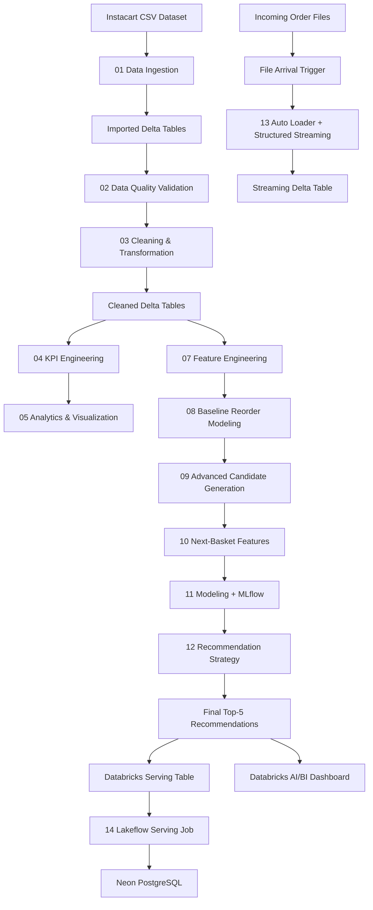
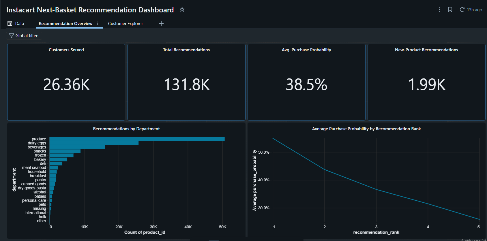
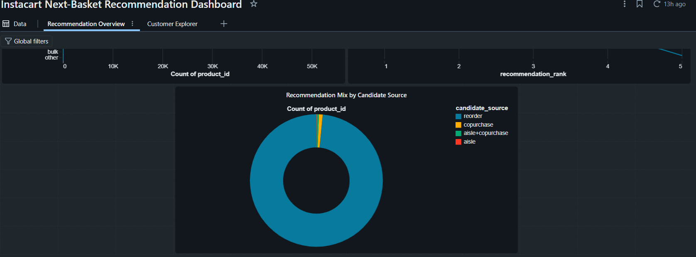
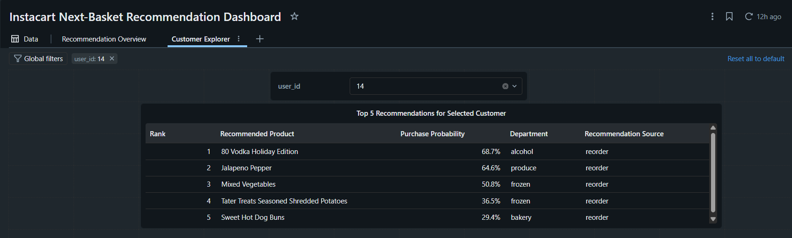

# Instacart End-to-End Data & Next-Basket Recommendation Pipeline

An end-to-end data engineering, analytics, machine learning, and recommendation project built with **Databricks, PySpark, Delta Lake, MLflow, PostgreSQL, and Neon**, using the Instacart Market Basket dataset.

The project covers the complete lifecycle:

- Data ingestion
- Data quality validation
- Cleaning and transformation
- KPI engineering
- Exploratory analytics
- Feature engineering
- Candidate generation
- Machine learning
- MLflow experiment tracking
- Next-basket recommendation
- Structured Streaming
- Databricks Auto Loader
- Lakeflow Jobs
- Neon PostgreSQL serving
- Interactive Databricks AI/BI dashboards
- Git and GitHub version control

The final objective is:

> **Predict the 5 products most likely to appear in each customer's next basket.**

---

# Project Overview

Online grocery platforms generate large volumes of transactional data that can be used to understand:

- Customer purchasing behavior
- Product popularity
- Customer loyalty
- Reorder patterns
- Category performance
- Ordering habits
- Product discovery
- Future basket composition

This project uses the **Instacart Market Basket Analysis** dataset to build a scalable pipeline in Databricks.

The project evolves from descriptive analytics into a complete next-basket recommendation workflow.

---

# Dataset

The project uses the **Instacart Market Basket Analysis** dataset.

Approximate scale:

| Metric | Value |
|---|---:|
| Customers | 206,209 |
| Orders | ~3.4M |
| Products | 49,688 |
| Aisles | 134 |
| Departments | 21 |
| Product-order interactions | 33.8M+ |

Main source tables:

- `orders`
- `order_products_prior`
- `order_products_train`
- `products`
- `aisles`
- `departments`

The dataset size makes it suitable for distributed processing using Apache Spark.

---

# Technology Stack

| Technology | Role |
|---|---|
| Databricks | Main data, analytics, ML and orchestration platform |
| Apache Spark / PySpark | Distributed processing |
| Spark SQL | Data querying and validation |
| Delta Lake | Persistent analytical storage |
| Unity Catalog | Data organization and governance |
| Python | Data and ML logic |
| Spark MLlib | Machine-learning pipelines |
| MLflow | Experiment tracking and model comparison |
| Databricks Auto Loader | Incremental file ingestion |
| Structured Streaming | Streaming processing |
| Lakeflow Jobs | Workflow orchestration |
| Databricks AI/BI Dashboard | Interactive visualization and recommendation demo |
| PostgreSQL | External serving database |
| Neon | Serverless PostgreSQL platform |
| Databricks Secrets | Secure credential management |
| Git | Version control |
| GitHub | Repository hosting and pull-request workflow |

---

# Final Architecture



The project currently has two operational workflows.

### Recommendation workflow

```text
Historical Instacart Data
        ↓
Feature Engineering
        ↓
Candidate Generation
        ↓
Next-Basket Features
        ↓
Machine Learning
        ↓
Top-5 Recommendation Strategy
        ↓
Databricks Serving Table
        ↓
Lakeflow Job
        ↓
Neon PostgreSQL
```

### Streaming workflow

```text
New Order File
        ↓
File Arrival Trigger
        ↓
Auto Loader
        ↓
Structured Streaming
        ↓
Delta Order Events Table
```

The streaming workflow demonstrates incremental ingestion.

It is intentionally separate from model retraining: a newly streamed order does **not automatically retrain the recommendation model**.

---

# Repository Structure

```text
instacart-databricks-analytics/
│
├── 01_importing_data.ipynb
├── 02_check_data_quality.ipynb
├── 03_cleaning_and_transformation.ipynb
├── 04_analysis_and_kpi.ipynb
├── 05_data_analysis_and_visualization.ipynb
├── 06_databricks_neon_postgres_setup.ipynb
├── 07_feature_engineering.ipynb
├── 08_reorder_prediction.ipynb
├── 09_advanced_candidate_generation.ipynb
├── 10_next_basket_feature_engineering.ipynb
├── 11_next_basket_modeling_mlflow.ipynb
├── 12_recommendation_strategy.ipynb
├── 13_streaming_ingestion.ipynb
├── 14_export_recommendations_to_neon.ipynb
│
├── images/
│   ├── dashboard_overview_top.png
│   ├── dashboard_overview_bottom.png
│   └── customer_explorer.png
│
├── .gitignore
└── README.md
```

---

# 01 — Data Ingestion

**Notebook:** `01_importing_data.ipynb`

The first notebook creates the initial data layer.

Main tasks:

- Load Instacart CSV files into Spark DataFrames
- Validate schemas
- Add ingestion metadata
- Persist datasets as Delta tables
- Compare source and persisted row counts

Output schema:

```text
workspace.imported_data
```

Main tables:

```text
aisles
departments
products
orders
order_products_prior
order_products_train
```

---

# 02 — Data Quality Validation

**Notebook:** `02_check_data_quality.ipynb`

Quality controls include:

- Missing-value checks
- Duplicate detection
- Referential-integrity validation
- Business-rule validation
- Order-sequence validation
- Basket-position validation
- Expected-domain checks

A missing product-category relationship was detected and handled without deleting the affected transaction.

---

# 03 — Cleaning and Transformation

**Notebook:** `03_cleaning_and_transformation.ipynb`

Main transformations include:

- Data type standardization
- Text normalization
- Product-name cleanup
- Missing-category handling
- Metadata creation
- Combination of prior and training transactions

Output schema:

```text
workspace.cleaned_data
```

Main tables:

```text
departments
aisles
products
orders
order_products
```

The combined order-product dataset contains approximately:

**33,819,106 rows**

---

# 04 — KPI Engineering

**Notebook:** `04_analysis_and_kpi.ipynb`

Reusable analytical tables are created instead of repeatedly calculating the same metrics inside visualization queries.

Output schema:

```text
workspace.analysis_data
```

Main analytical tables include:

```text
order_kpis
customer_kpis
product_kpis
aisle_kpis
department_kpis
daily_kpis
hourly_kpis
time_period_kpis
```

They support customer, product, category and temporal analysis.

---

# 05 — Data Analysis and Visualization

**Notebook:** `05_data_analysis_and_visualization.ipynb`

The analytical layer is used to study:

- Most purchased products
- Product reorder behavior
- Product popularity vs loyalty
- Department performance
- Aisle performance
- Customer order frequency
- Customer segmentation
- Orders by day
- Orders by hour
- Orders by time period

One major descriptive finding is that **produce dominates purchasing activity**, particularly fresh fruits and vegetables.

---

# 06 — Neon PostgreSQL Integration

**Notebook:** `06_databricks_neon_postgres_setup.ipynb`

Databricks is connected to a serverless PostgreSQL database hosted on Neon.

Seven analytical KPI tables are exported to Neon:

```text
public.aisle_kpis
public.customer_kpis
public.daily_kpis
public.department_kpis
public.hourly_kpis
public.product_kpis
public.time_period_kpis
```

Database credentials are not hard-coded.

The password is retrieved through Databricks Secrets:

```python
neon_password = dbutils.secrets.get(
    scope="neon",
    key="password"
)
```

---

# 07 — Feature Engineering

**Notebook:** `07_feature_engineering.ipynb`

A historical customer-product feature dataset is created for reorder prediction.

Output:

```text
workspace.ml_data.reorder_features
```

Dataset scale:

| Metric | Value |
|---|---:|
| Rows | 8,474,661 |
| Customers | 131,209 |
| Products | 49,468 |
| Positive reorder labels | 828,824 |
| Positive rate | 9.78% |
| Columns | 74 |

Feature groups include:

- Customer behavior
- Product behavior
- Customer-product interaction
- Recency
- Reorder cycles
- Momentum
- Streaks
- Category affinity
- Temporal compatibility
- Basket context

The initial candidate set only contains products previously purchased by each customer.

Baseline candidate coverage:

**59.86%**

---

# 08 — Baseline Reorder Prediction

**Notebook:** `08_reorder_prediction.ipynb`

The baseline model compares three Spark ML algorithms.

| Model | ROC-AUC | PR-AUC |
|---|---:|---:|
| Logistic Regression | 0.8270 | 0.4093 |
| Random Forest | 0.8163 | 0.4034 |
| Gradient Boosted Trees | 0.8295 | 0.4171 |

Baseline Top-5 performance:

| Metric | Result |
|---|---:|
| Precision@5 | 0.3860 |
| Recall@5 | 0.4052 |
| Hit Rate@5 | 0.8044 |
| NDCG@5 | 0.5259 |
| MAP@5 | 0.4248 |

The main limitation was that the candidate universe only contained previously purchased products.

---

# 09 — Advanced Candidate Generation

**Notebook:** `09_advanced_candidate_generation.ipynb`

The candidate universe is expanded using:

- Historical reorder candidates
- Aisle-based candidates
- Co-purchase candidates

Several candidate budgets were evaluated.

| Strategy | Candidate Coverage |
|---|---:|
| Historical products only | 59.86% |
| Top 20 aisle + Top 10 co-purchase | 62.52% |
| Top 30 aisle + Top 15 co-purchase | 63.12% |
| All candidates | 63.69% |

The selected strategy uses:

**Top 30 aisle candidates + Top 15 co-purchase candidates**

Coverage improves from:

**59.86% → 63.12%**

Improvement:

**+3.26 percentage points**

Final candidate table:

```text
workspace.ml_data.next_basket_candidates
```

Scale:

- 13,519,765 candidate rows
- 131,209 customers
- 873,920 positive labels

---

# 10 — Next-Basket Feature Engineering

**Notebook:** `10_next_basket_feature_engineering.ipynb`

The expanded candidate universe is enriched with features for final next-basket scoring.

Output:

```text
workspace.ml_data.next_basket_features
```

Scale:

| Metric | Value |
|---|---:|
| Rows | 13,519,765 |
| Customers | 131,209 |
| Positive labels | 873,920 |
| Columns | 84 |
| Duplicate candidates | 0 |
| Missing feature values | 0 |

Feature groups include:

- Customer behavior
- Product behavior
- Customer-product interaction
- Recency
- Reorder cycle
- Shopping-time compatibility
- Category affinity
- Candidate-source scores
- New-product indicators
- Recent basket context

---

# 11 — Next-Basket Modeling with MLflow

**Notebook:** `11_next_basket_modeling_mlflow.ipynb`

A permanent customer-level train/validation split is used.

This prevents customer leakage between training and validation.

Validation set:

- **26,360 customers**
- **2,715,125 candidate rows**
- **174,199 positive labels**

After categorical encoding, the final feature vector contains:

**233 features**

MLflow is used to track model experiments.

### Final Model Comparison

| Model | ROC-AUC | PR-AUC | Training Time |
|---|---:|---:|---:|
| Logistic Regression | 0.8650 | 0.3870 | ~2.45 min |
| Gradient Boosted Trees | 0.8676 | 0.3966 | ~33.3 min |

GBT achieved slightly better predictive performance.

However, **Logistic Regression was selected as the practical scoring model** because its performance is very close while requiring much less training time.

GBT remains an accuracy benchmark.

---

# 12 — Recommendation Strategy

**Notebook:** `12_recommendation_strategy.ipynb`

Model probabilities are converted into final Top-5 recommendations.

Baseline Top-5 performance:

| Metric | Result |
|---|---:|
| Precision@5 | 0.3793 |
| Recall@5 within candidate set | 0.3558 |
| Hit Rate@5 | 0.8025 |
| End-to-End Recall@5 | 0.2492 |

The recommendation strategy balances:

```text
Repeat-purchase accuracy
vs.
New-product discovery
```

Several strategies were evaluated.

The selected strategy conditionally includes a new-product recommendation when its probability is at least:

**0.04**

This increases product discovery while preserving most overall recommendation quality.

Final serving table:

```text
workspace.ml_data.next_basket_serving_recommendations
```

Final output:

| Metric | Value |
|---|---:|
| Customers | 26,360 |
| Recommendations/customer | 5 |
| Total recommendations | 131,800 |
| New-product recommendations | ~1,988 |

Final serving fields include:

```text
user_id
target_order_id
recommendation_rank
product_id
product_name
aisle
department
purchase_probability
is_new_to_customer
candidate_source
recommendation_strategy
```

---

# 13 — Streaming Ingestion

**Notebook:** `13_streaming_ingestion.ipynb`

The project includes event-driven incremental ingestion using:

- Databricks Auto Loader
- Structured Streaming
- Delta Lake
- Unity Catalog
- Checkpointing
- Lakeflow Jobs
- File-arrival triggers

Incoming path:

```text
/Volumes/workspace/streaming_data/streaming_files/incoming_orders
```

Streaming output table:

```text
workspace.streaming_data.order_events
```

When a new file arrives, the Lakeflow Job triggers the streaming notebook.

Checkpointing prevents previously processed files from being ingested repeatedly.

### Important Architecture Note

Streaming ingestion is currently independent from recommendation retraining.

```text
New order file
       ↓
Auto Loader
       ↓
Structured Streaming
       ↓
order_events Delta table
```

A newly ingested order does **not automatically retrain the model**.

---

# 14 — Recommendation Serving to Neon

**Notebook:** `14_export_recommendations_to_neon.ipynb`

Final recommendations are exported from Databricks into Neon PostgreSQL.

Architecture:

```text
Databricks Serving Table
        ↓
Lakeflow Serving Job
        ↓
PostgreSQL Connector
        ↓
Neon PostgreSQL
```

Target PostgreSQL table:

```text
next_basket_recommendations
```

Verified exported row count:

**131,800**

The export uses Databricks Secrets for secure credential retrieval.

---

# Lakeflow Jobs

Two separate Lakeflow workflows are implemented.

## Streaming Ingestion Job

```text
New Order File
      ↓
File Arrival Trigger
      ↓
Notebook 13
      ↓
Auto Loader
      ↓
Streaming Delta Table
```

## Recommendation Serving Job

```text
Final Recommendation Table
      ↓
Notebook 14
      ↓
Neon PostgreSQL
```

The workflows remain separate because streaming ingestion does not currently trigger model retraining.

---

# Final Databricks AI/BI Dashboard

The final recommendation dashboard contains two pages.

---

## Recommendation Overview



Main KPIs:

| KPI | Value |
|---|---:|
| Customers Served | 26.36K |
| Total Recommendations | 131.8K |
| Average Purchase Probability | 38.5% |
| New-Product Recommendations | 1.99K |

The page also includes:

- Recommendations by Department
- Average Purchase Probability by Recommendation Rank
- Recommendation Mix by Candidate Source



---

## Customer Explorer

The Customer Explorer provides an interactive demonstration of the recommendation system.



A customer ID can be selected and the dashboard displays that customer's Top-5 recommendations.

Displayed fields:

- Rank
- Recommended Product
- Purchase Probability
- Department
- Recommendation Source

This provides a user-facing demonstration of the final recommendation output.

---

# Final Results

| Metric | Result |
|---|---:|
| Transaction records processed | 33.8M+ |
| Historical feature rows | 8.47M |
| Final candidate rows | 13.52M |
| Baseline candidate coverage | 59.86% |
| Final candidate coverage | 63.12% |
| Candidate coverage improvement | +3.26 pp |
| Validation customers | 26,360 |
| Logistic Regression ROC-AUC | 0.8650 |
| GBT ROC-AUC | 0.8676 |
| Final Precision@5 | 0.3793 |
| Final Hit Rate@5 | 80.25% |
| Final recommendations | 131,800 |
| New-product recommendations | ~1,988 |
| Neon serving rows | 131,800 |

---

# Data Layers

The project separates data responsibilities into several schemas.

```text
workspace.imported_data
        ↓
workspace.cleaned_data
        ↓
workspace.analysis_data
        ↓
workspace.ml_data

workspace.streaming_data
```

This separation keeps ingestion, transformation, analytics, machine learning and streaming concerns organized.

---

# Engineering Principles

### Separation of Concerns

Each notebook performs a clearly defined responsibility.

### Data Quality Before Transformation

Quality validation is performed before downstream transformations.

### Persistent Delta Tables

Intermediate, analytical and ML datasets are stored as Delta tables.

### Customer-Level Validation Split

Customers do not overlap between model training and validation.

### Candidate Generation Before Scoring

The system avoids scoring every product for every customer.

### MLflow Experiment Tracking

Model performance and training time are compared systematically.

### Practical Model Selection

The final scoring model is selected using both predictive performance and computational cost.

### Secure Credential Management

Neon credentials are stored using Databricks Secrets.

### Incremental Streaming

Auto Loader and checkpointing provide incremental ingestion.

### Honest Workflow Separation

Streaming ingestion and recommendation retraining are not presented as the same process.

---

# Project Status

| Phase | Status |
|---|---|
| Data ingestion | ✅ Completed |
| Data quality validation | ✅ Completed |
| Data cleaning | ✅ Completed |
| Delta Lake persistence | ✅ Completed |
| KPI engineering | ✅ Completed |
| Exploratory analysis | ✅ Completed |
| Neon PostgreSQL integration | ✅ Completed |
| Feature engineering | ✅ Completed |
| Baseline reorder modeling | ✅ Completed |
| Candidate generation | ✅ Completed |
| Next-basket feature engineering | ✅ Completed |
| MLflow model comparison | ✅ Completed |
| Recommendation strategy | ✅ Completed |
| Top-5 recommendation serving | ✅ Completed |
| Structured Streaming | ✅ Completed |
| Auto Loader ingestion | ✅ Completed |
| Lakeflow Jobs | ✅ Completed |
| Neon recommendation serving | ✅ Completed |
| AI/BI recommendation dashboard | ✅ Completed |
| Customer Explorer | ✅ Completed |

---

# How to Run the Project

## 1. Clone the Repository

```bash
git clone https://github.com/nour2344/instacart-databricks-analytics.git
cd instacart-databricks-analytics
```

## 2. Import the Notebooks into Databricks

Run the notebooks in numerical order:

```text
01_importing_data
02_check_data_quality
03_cleaning_and_transformation
04_analysis_and_kpi
05_data_analysis_and_visualization
06_databricks_neon_postgres_setup
07_feature_engineering
08_reorder_prediction
09_advanced_candidate_generation
10_next_basket_feature_engineering
11_next_basket_modeling_mlflow
12_recommendation_strategy
13_streaming_ingestion
14_export_recommendations_to_neon
```

## 3. Configure the Instacart Dataset

Make the Instacart CSV files available to Databricks and update the source paths if necessary.

## 4. Configure Neon

Create a Neon PostgreSQL database and store the password securely using Databricks Secrets.

Example:

```python
neon_password = dbutils.secrets.get(
    scope="neon",
    key="password"
)
```

---

# Key Skills Demonstrated

This project demonstrates practical experience with:

- Data Engineering
- Data Analytics
- Databricks
- Apache Spark
- PySpark
- Spark SQL
- Delta Lake
- Unity Catalog
- ETL / ELT
- Data Quality
- Data Transformation
- KPI Engineering
- Feature Engineering
- Machine Learning
- Spark MLlib
- Recommendation Systems
- Candidate Generation
- Ranking Strategies
- MLflow
- Structured Streaming
- Auto Loader
- File-Arrival Triggers
- Lakeflow Jobs
- PostgreSQL
- Neon
- Secret Management
- Databricks AI/BI Dashboards
- Git
- GitHub
- Branching
- Pull Requests

---

# Future Improvements

Possible future extensions include:

- Scheduled model retraining
- Model drift monitoring
- Automatic recommendation refresh after sufficient new customer activity
- Recommendation API
- Online feature serving
- A/B testing
- Advanced ranking models
- Additional product-discovery strategies
- CI/CD validation with GitHub Actions

---

# Author

**Nour**

Data Engineering / Machine Learning / Analytics portfolio project developed using Databricks.

---

## Repository

`nour2344/instacart-databricks-analytics`
